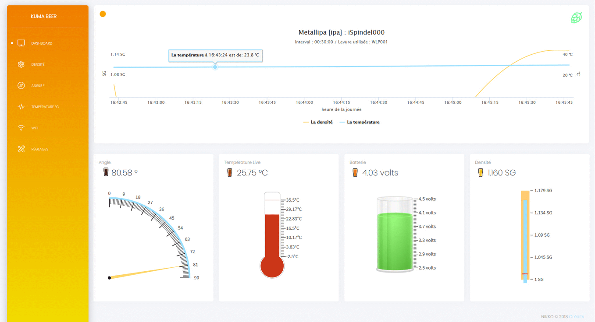

iSpindle Dashboard est un outil Bootstrap pour visualiser les données de son iSpindle.
Vous pouvez afficher la Densité, la température, la charge de la batterie et pas mal d'autres petites choses.
Il est aussi possible d"'exporter la base de donnée dans un fichier csv, ainsi que de la vider directement depuis le dashboard.'
C'est créé pour être hébergé en ligne sur un site perso par exemple et combiné avec une base de donnée sql.
Mais l'ensemble fonctionne aussi très bien sur un réseau local.

Enjoy. -Nikko-

Pour le moment le dashboard ne permet d'afficher les données que d'un seul iSpindle.
Je pourrais changer ça à l'avenir.

ps : je ne suis pas dev, c'est donc livré tel quel, avec du code pas bien propre et quelques petites choses inutiles...
Je pourrais nettoyer tout ça dans le futur, ou pas ^^

## VERSION

- V 1.0.6 (Fixed Problème de commpatibilité avec PHP 7 )
- V 1.0.5 (Update du code pour les utilisateurs qui sont sur un réseau local)
- V 1.0.4

## INSTALLATION

- Vous devez créer les table dans votre base de donnée, utilisez l'exemple présent dans le fichier "creationTablesSQL.php"
- Ensuite dans lancez votre iSpindle en mode configuration et dans "Service Type" utilisez HTTP, pour "Server Adress" entrez l'adresse de votre website (ex: monwebsite.com) et pour "Server URL" l'url de votre dossier (ex: /myfolder/)
- Editez ensuite les fichiers "index.php" , "common_db.php" et "csvexport.php" avec les informations de connexion à votre base de donnée
- Dans le fichier "csvexport.php" vous pouvez aussi changer "$f = fopen('php://memory', 'w');" par "$f = fopen('../csv/FILE_NAME.csv', 'w');" si vous souhaitez exporter en même temps votre fichier csv sur votre FTP
- Dans le fichier "settings.php" à la ligne numéro 57, rempalcez "MONPASSWORD" par le mot de passe de vitre choix (n'utilisez pas le même que pour votre base de donnée !)
- Enfin, envoyez le tout sur votre FTP (en conservant bien la structure des dossiers !)
- Et pour finir rendez vous à l'adresse de votre dashboard et entrez les réglages que vous souhaitez dans la partie "réglages"

## COPYRIGHTS

- Tout a été customisé et mixé par Nikko
- Basé sur le travail de DottoreTozzi (https://github.com/DottoreTozzi/iSpindel-TCP-Server)
- Code de base du dashbaord par Creative Tim (https://www.creative-tim.com/)
  | Licensed under MIT (https://github.com/creativetimofficial/black-dashboard/issues/blob/master/LICENSE.md)
- Charts par Highcharts (https://www.highcharts.com) et Fusioncharts (https://www.fusioncharts.com)

## LIENS UTILES

- [iSpindel](https://github.com/universam1/iSpindel)
- [TCP Server](https://github.com/DottoreTozzi/iSpindel-TCP-Server)

## IMAGES

